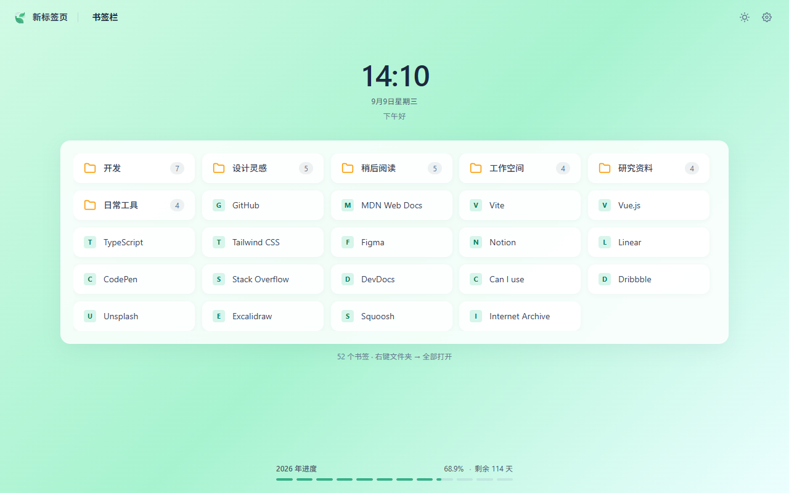

<p align="center">
  
</p>

# Leafmark · 叶签

把浏览器书签带回新标签页。Leafmark 用毛玻璃卡片展示原生书签，支持文件夹悬停预览、整理收藏和个性化布局。

*A bookmark-focused new tab for Chrome and Edge, with folder previews, bookmark management, and local customization.*

**Edge 正式版 1.0.0 已通过审核**：[从 Microsoft Edge 商店安装叶签](https://microsoftedge.microsoft.com/addons/detail/ncpniokijejakopmbfcjonalbdbggdah)。

当前仓库为 **1.1.0 更新候选版**，新增多选、批量移动和六组传统色主题；可通过加载已解压扩展体验。商店素材与发布记录见 [store-assets](./store-assets/README.md)。



## 功能

- **原生书签**：选择主页文件夹，通过面包屑导航；编辑、删除和拖拽直接写回浏览器书签。
- **多选与批量移动**：通过顶栏或右键进入多选，支持连续选择、全选，将书签和完整文件夹按展示顺序移到目标目录。
- **悬停预览**：文件夹支持多层级联；大目录按视口分页，Esc 或点击外部关闭。
- **删除撤销**：恢复最近一次删除，包括文件夹和批量清理；保存恢复进度，协调多个新标签页的操作。
- **重复检测**：按完整 URL 精确分组，显示所在目录，由你选择保留副本。
- **链接检测**：手动检查全部书签或指定文件夹，设置 3–60 秒超时和忽略域名，核实结果后选择清理。
- **快捷打开**：一键打开文件夹并分组，支持 Ctrl/⌘ 点击、中键和前后台打开。
- **二维码**：本地生成、复制链接和下载 PNG。
- **外观设置**：浅色、深色、跟随系统；预设或上传壁纸、10 款渐变主题、布局和透明度调节。新增雨过天青、艾绿春山、藕荷暮色、酪黄暖阳、丁香微雨、月白松烟。
- **页面显示**：时钟、日期、问候语、年度进度和书签统计可分别开关；支持简体中文和英文。

## 本地安装

使用 Chrome / Microsoft Edge **111 或更新版本**，建议使用浏览器的当前稳定版。

1. 准备 Node.js 22.12+ 和 pnpm 11.5.1，在仓库目录执行：

   ```powershell
   pnpm install --frozen-lockfile
   pnpm build
   ```

2. 打开 `chrome://extensions` 或 `edge://extensions`，启用「开发者模式」。
3. 点击「加载已解压的扩展程序」，选择仓库中的 **dist/** 目录。
4. 打开新标签页，按浏览器提示启用 Leafmark 的新标签页。

也可以解压本地生成的 `leafmark-v1.1.0.zip`，再加载解压后的目录。更新构建后，在扩展管理页刷新扩展。

## 常用操作

| 操作 | 方法 |
| --- | --- |
| 预览文件夹 | 悬停约 250ms；也可单击或按 Enter 打开 |
| 设置主页 | 右键文件夹 →「设为主页」；可从右键菜单或设置恢复默认书签栏 |
| 整理书签 | 右键编辑、复制、删除；拖到卡片两侧调整顺序，拖到文件夹中部移入 |
| 多选项目 | 顶栏「多选」，或右键某个项目 →「多选」；点击勾选，Shift 点击连续选择 |
| 批量移动 | 多选后点「移动到…」，选择目标文件夹并确认；可同时移动书签与文件夹 |
| 撤销删除 | 使用顶栏或清理面板的撤销按钮 |
| 后台打开 | Ctrl/⌘ 点击或中键；Ctrl/⌘+Shift 点击在前台打开 |
| 批量打开 | 右键文件夹 →「全部打开」，自动创建标签组 |
| 检查重复或失效链接 | 设置 → 通用 → 对应检测入口 |
| 调整界面 | 设置 → 外观 / 布局；滑块即时预览，合并保存 |

确认框和其他模态对话框支持 Tab、Shift+Tab、Esc，关闭后恢复原先焦点。

多选模式下，Ctrl/⌘+A 选择当前目录全部可移动项目，Esc 或「完成」退出；切换目录会清空选择。普通浏览模式仍保留 Ctrl/⌘ 点击和中键打开书签的行为。

## 隐私与权限

Leafmark 没有开发者账号体系、广告、遥测或开发者数据接收服务，不向开发者上传书签清单或检测结果。

- 书签由浏览器原生 API 读写，浏览器自身的书签同步设置仍然有效。
- 外观等偏好使用浏览器的 `storage.sync`，可能由浏览器自身的同步服务同步。
- 上传壁纸、最近一次删除快照、检测范围和忽略域名保存在本机扩展存储中。
- 链接检测需要你主动启动并授予可选网站访问权限。请求直接发送到收藏网站，这些网站会收到请求 URL、IP 地址等正常网络信息；检测请求不携带 Cookie 或 Referer。
- 二维码在本地生成；扩展不加载或执行远程代码。

| 权限 | 用途 |
| --- | --- |
| `bookmarks` | 展示、编辑、排序、删除和恢复书签 |
| `favicon` | 使用浏览器提供的网站图标 |
| `storage` | 保存设置、壁纸、撤销记录和检测配置 |
| `tabGroups` | 为批量打开的书签设置标签组名称和颜色 |
| 可选 HTTP/HTTPS 网站访问 | 手动检测收藏网址及其重定向目标 |

完整说明见 [隐私政策](./store-assets/privacy/PRIVACY.md)。

## 开发

技术栈：Vue 3 Composition API、TypeScript、Pinia、Vite 8、Tailwind CSS 4、Vitest。

| 命令 | 用途 |
| --- | --- |
| `pnpm dev` | Web 开发预览，地址为 `http://localhost:5173/src/newtab/index.html` |
| `pnpm watch` | 监听文件变化，持续构建到 `dist/`；需在浏览器中刷新扩展 |
| `pnpm build` | 类型检查并构建扩展 |
| `pnpm preview` | 预览构建结果，入口为 `/src/newtab/index.html` |
| `pnpm test` | 运行自动化测试 |
| `pnpm coverage` | 测试并检查覆盖率阈值，报告输出到 `artifacts/coverage/` |
| `pnpm typecheck` | TypeScript / Vue 类型检查 |
| `pnpm lint` | ESLint 检查 |
| `pnpm zip` | 将已有 `dist/` 打包，执行前先运行 `pnpm build` |
| `pnpm icons` | 从项目内的绘制脚本生成扩展图标 |

Web 预览使用示例书签和 `localStorage`，适合调整界面。原生书签写入、标签分组和网站权限申请应在加载扩展后验证。

```text
src/newtab/       新标签页入口和布局
src/components/   卡片、面板和对话框
src/stores/       书签、设置、撤销和检测状态
src/composables/  悬停、焦点和时钟逻辑
src/lib/          浏览器 API 适配与领域逻辑
public/           MV3 manifest、图标和商店语言资源
tests/            单元、状态和组件测试
docs/             功能决定、实现计划和验证记录
store-assets/     商店文案、截图、推广图和隐私政策
```

GitHub Actions 会在 push 和 pull request 时执行锁文件安装、类型检查、lint、覆盖率和构建。覆盖率统计包含 Vue 组件；全量阈值为语句/行/函数 80%、分支 70%，核心逻辑另有较高阈值。

## 使用边界

- 撤销仅保留最近一次删除；下一次成功删除会替换记录。恢复后书签使用新 id，历史创建时间无法保留。
- 批量移动追加到目标目录末尾，并保留项目 id；原目录、自身及其子目录不能作为目标。部分成功时保留失败项供重试，重试成功的项目继续追加到末尾；移动不计入删除撤销记录。
- 重复检测保留查询参数和片段差异；它们不同的 URL 不会被当作同一地址。
- 链接检测反映本次 HTTP 请求的结果。登录限制、限流或临时网络故障可能影响判断，清理前请先打开核实。
- 大目录的悬停面板采用分页；主网格仍完整挂载当前目录，较大目录会增加首次渲染成本。

## 文档与反馈

- [功能范围与技术选型](./docs/02-决定-功能范围与技术选型.md)
- [实现计划与最新验证](./docs/03-实现计划.md)
- [链接可访问性检测](./docs/05-链接可访问性检测.md)
- [书签管理增强](./docs/06-书签管理增强.md)
- [多选与批量移动](./docs/07-多选与批量移动.md)
- [传统色主题](./docs/08-传统色主题.md)
- [商店素材与提审准备](./store-assets/README.md)
- [提交问题或建议](https://github.com/zcpin/leafmark/issues)
